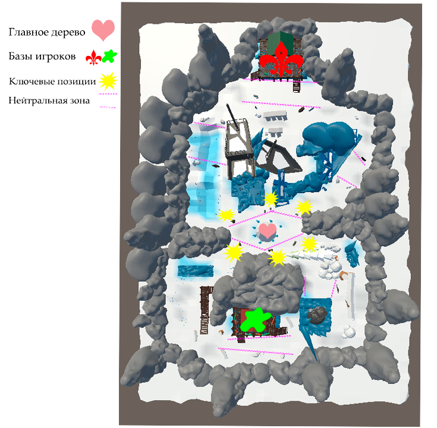

# Заледеневшая Гавань

## Описание локации
**Заледеневшая Гавань** — это заброшенный порт, замерзший в суровых условиях вечной зимы. Здесь застряли обледенелые корабли, а вдоль побережья видны заснеженные деревья и пустующие здания, затянутые льдом. Локация окружена холодной пустошью и замерзшими водоемами.

## Цель игры
Цель игры — добыть дрова из центрального дерева и донести их до своей базы, чтобы растопить печь. Каждый игрок начинает матч на своей базе, где лежит топор, необходимый для срубки дерева. После взятия топора он отображается в UI, позволяя взаимодействовать с деревом. Команда получает очко за доставку дров в печь на своей базе.

### Условия победы
1. Матч длится 20 минут.
2. Если до истечения времени одна из команд набирает 3 очка, она побеждает.
3. В случае равного количества очков, матч считается проигранным для обеих команд.

Игроки, погибшие в бою, возрождаются на базе. Когда команда зарабатывает очко, все участники направляются на базу для короткой фазы закупки.

## Ключевые точки на локации
- **Центральное дерево**: Основная цель, где происходит рубка дерева.
- **Базы команд**: Здесь игроки возрождаются, закупаются, а также размещены печи, куда нужно доставить дрова для получения очков.
- **Пирс и заснеженные постройки**: Обеспечивают прикрытие и возможности для стратегического маневра.
- **Ледяной водоем и сосульки**.
- **Скалы и пещеры**: Создают точки для засад и позволяют временно укрыться от противника.

## Билд проекта

### Том 1 и Том 2 в папке QuickCheck
Проект разделен на два тома, поэтому его необходимо распаковать как двухтомный архив. В той же папке находится видеопредставление карты.
